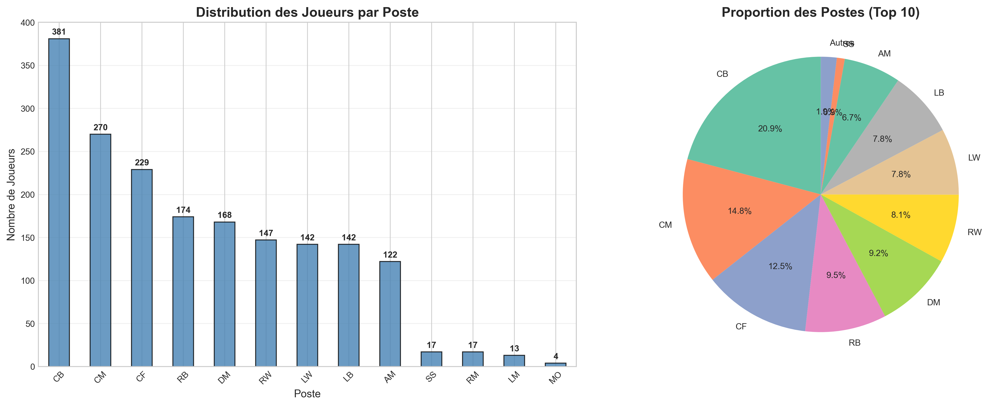
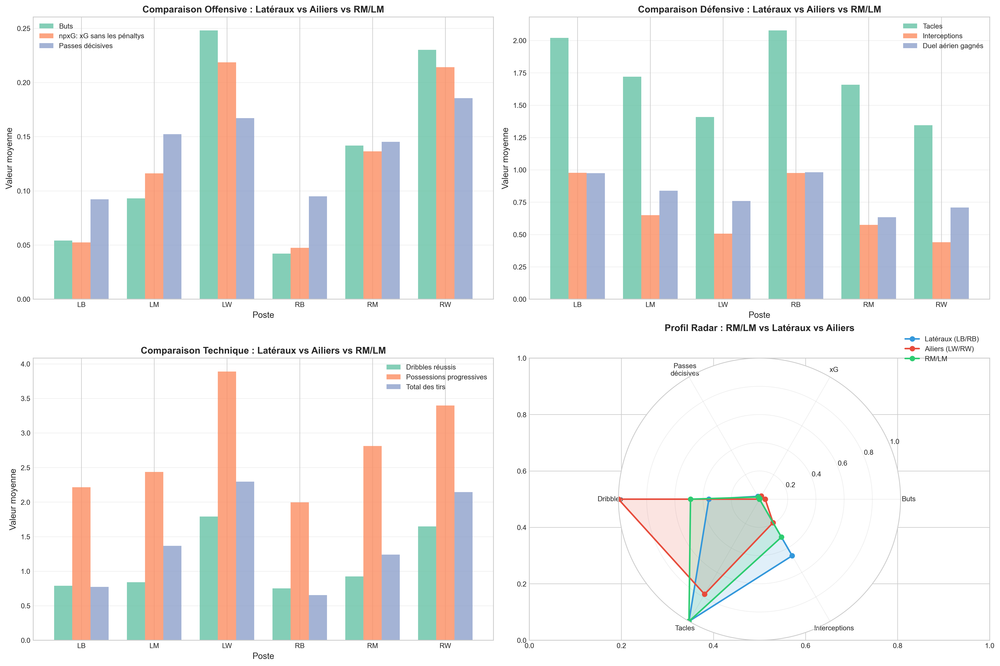
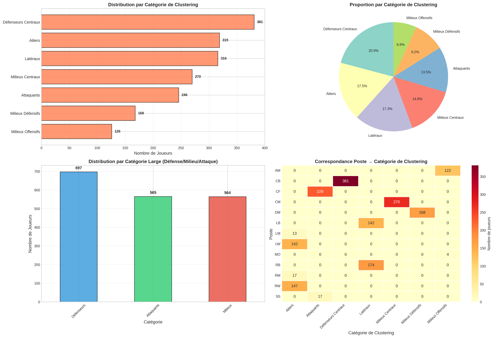
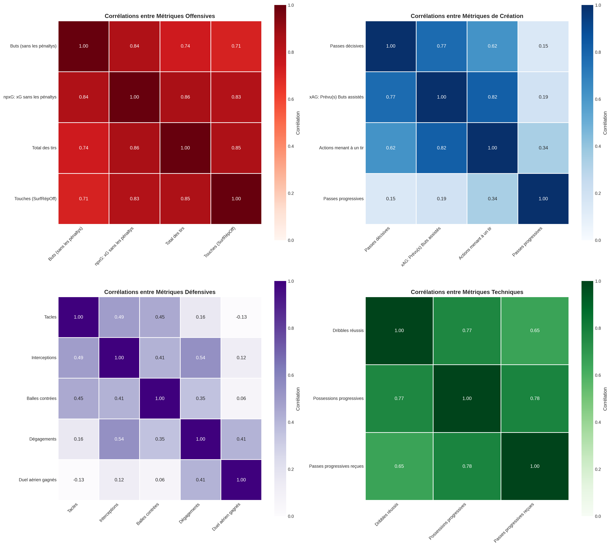
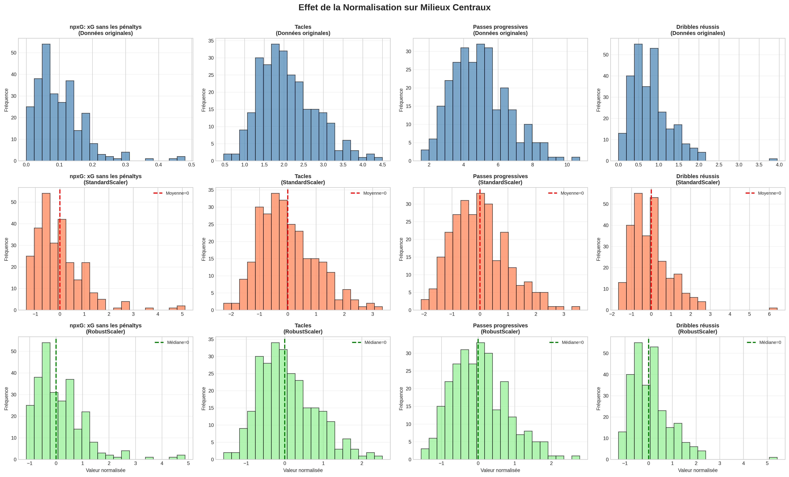
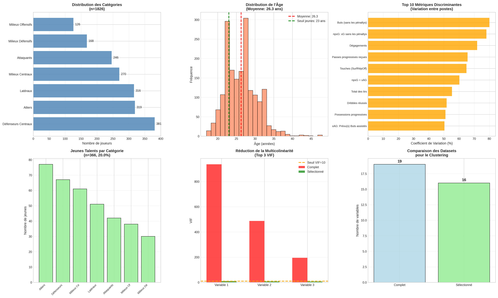
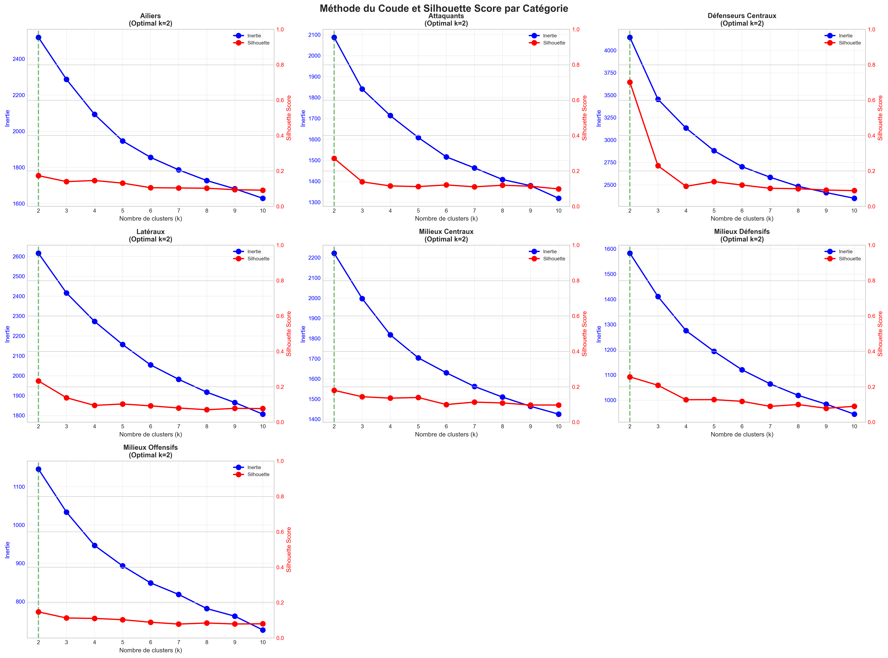
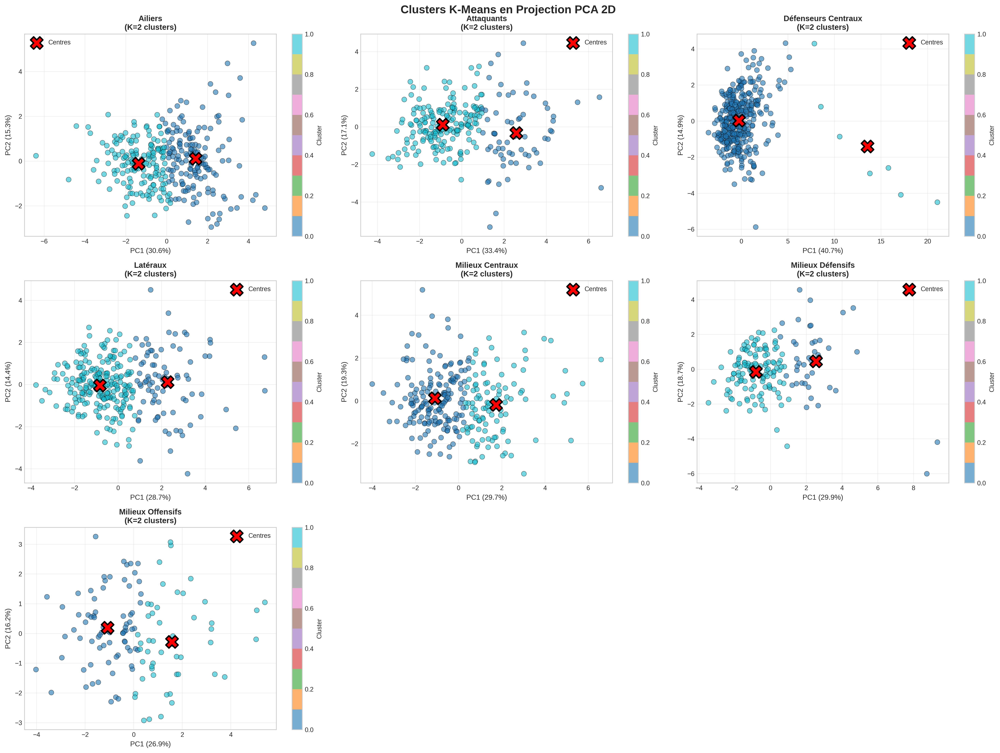
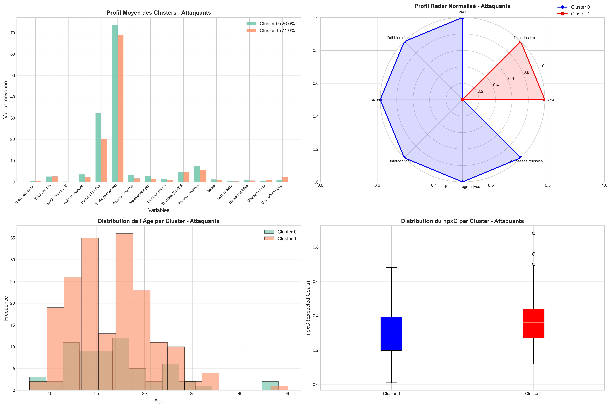

# Clustering de Joueurs de Football : Identification de Profils Similaires pour le Recrutement et la Détection de Talents

Amine ITJI & Youssef BOUAMAMA

---

## Résumé Exécutif

Ce projet développe un système de clustering non supervisé pour analyser 1826 joueurs de football professionnels des cinq grands championnats européens. L'objectif principal est d'identifier des joueurs aux profils statistiques similaires pour faciliter le recrutement et la détection de jeunes talents. En utilisant l'algorithme K-Means sur 16 variables statistiques normalisées, nous avons identifié 223 jeunes joueurs (< 23 ans) présentant des profils similaires aux joueurs établis ou élites, validant ainsi l'applicabilité du clustering pour résoudre des problématiques concrètes de recrutement sportif.

**Mots-clés** : Clustering, K-Means, Football, Recrutement sportif, Détection de talents, Analyse de données

---

## Table des Matières

1. [Introduction](#1-introduction)
2. [Données et Prétraitement](#2-données-et-prétraitement)
3. [Méthodologie](#3-méthodologie)
4. [Résultats](#4-résultats)
5. [Applications Pratiques](#5-applications-pratiques)
6. [Discussion](#6-discussion)
7. [Conclusion](#7-conclusion)
8. [Références](#8-références)
9. [Annexes](#9-annexes)

---

## 1. Introduction

### 1.1 Contexte et Problématique

Dans le football moderne, les clubs professionnels font face à des défis stratégiques majeurs en matière de gestion d'effectif et de recrutement. Le coût croissant des transferts et la compétition internationale accrue rendent crucial l'identification précise de joueurs capables de remplacer des éléments clés ou d'apporter une contribution tactique spécifique. Trois problématiques principales émergent :

1. **Remplacement de joueurs blessés** : Comment identifier rapidement un remplaçant présentant un profil statistique et tactique similaire ?
2. **Détection de jeunes talents** : Comment repérer des joueurs émergents (< 23 ans) ayant des caractéristiques comparables aux joueurs établis ou élites ?
3. **Optimisation du recrutement** : Comment quantifier objectivement la similarité entre joueurs pour prendre des décisions data-driven ?

### 1.2 Question de Recherche

**Comment le clustering non supervisé peut-il identifier automatiquement des joueurs aux profils statistiques similaires, en tenant compte des spécificités positionnelles, pour faciliter le recrutement et la détection de talents ?**

### 1.3 Objectifs

Les objectifs spécifiques de ce projet sont :

- Développer une méthodologie rigoureuse de clustering adaptée aux données footballistiques
- Identifier des groupes homogènes de joueurs au sein de chaque catégorie positionnelle
- Détecter les jeunes talents (< 23 ans) présentant des profils similaires aux joueurs établis
- Valider l'applicabilité du système sur des cas d'usage concrets de recrutement

### 1.4 Structure du Document

Ce rapport présente d'abord les données et leur prétraitement (section 2), puis détaille la méthodologie de clustering employée (section 3). Les résultats sont ensuite analysés par catégorie de poste (section 4), avant de démontrer l'applicabilité pratique du système (section 5). Une discussion critique des limites et perspectives conclut le document (sections 6-7).

---

## 2. Données et Prétraitement

### 2.1 Description du Dataset

Le dataset initial contient **1826 joueurs** issus des cinq grands championnats européens (Premier League, La Liga, Serie A, Bundesliga, Ligue 1), avec **23 variables** dont 19 statistiques de performance normalisées par 90 minutes jouées.

**Tableau 1 : Caractéristiques du dataset**

| Dimension | Valeur |
|-----------|--------|
| Nombre de joueurs | 1826 |
| Variables totales | 23 |
| Variables statistiques | 19 |
| Catégories de poste | 7 |
| Postes spécifiques | 13 |
| Jeunes talents (< 23 ans) | 366 (20.0%) |
| Valeurs manquantes (après nettoyage) | 0 |
| Doublons supprimés | 2 |

Les variables couvrent quatre dimensions de la performance :

1. **Performance offensive** : npxG (Expected Goals hors penalties), Total des tirs, Touches dans la surface adverse
2. **Création de jeu** : xAG (Expected Assisted Goals), Actions menant à un tir, Passes progressives
3. **Technique individuelle** : Dribbles réussis, Possessions progressives
4. **Contribution défensive** : Tacles, Interceptions, Dégagements, Duels aériens gagnés

**Figure 1** : Distribution des joueurs par poste dans le dataset

### 2.2 Catégorisation Tactique des Postes

Une étape critique du prétraitement concerne la catégorisation des postes en groupes tactiquement cohérents. Les 13 postes spécifiques ont été regroupés en **7 catégories** respectant les réalités du football moderne :

**Tableau 2 : Catégorisation des postes**

| Catégorie | Postes inclus | Effectif | Pourcentage |
|-----------|---------------|----------|-------------|
| Défenseurs Centraux | CB | 381 | 20.9% |
| Ailiers | LW, RW, RM, LM | 319 | 17.5% |
| Latéraux | LB, RB | 316 | 17.3% |
| Milieux Centraux | CM | 270 | 14.8% |
| Attaquants | CF, SS | 246 | 13.5% |
| Milieux Défensifs | DM | 168 | 9.2% |
| Milieux Offensifs | AM, MO | 126 | 6.9% |

#### 2.2.1 Cas Particulier : RM/LM

Les postes de milieux latéraux (RM/LM) présentent une ambiguïté tactique : s'agit-il de latéraux offensifs (pistons en 3-4-3) ou d'ailiers repositionnés (4-4-2) ? Une analyse statistique comparative a été réalisée pour trancher.

**Figure 2** : Comparaison statistique des RM/LM avec latéraux et ailiers

**Résultats de l'analyse** :
- Distance euclidienne RM/LM vs Latéraux : 0.518
- Distance euclidienne RM/LM vs Ailiers : 0.358
- **Conclusion** : Les RM/LM sont statistiquement plus proches des ailiers (+80% dribbles, +71% possessions progressives)

Les RM/LM ont donc été **catégorisés avec les Ailiers**, respectant leur profil offensif-créateur plutôt que défensif.

**Figure 3** : Catégorisation finale retenue pour le clustering

### 2.3 Traitement de la Multicolinéarité

L'analyse des corrélations a révélé **20 paires de variables fortement corrélées** (|r| > 0.7), notamment :

- Buts ↔ npxG (r = 0.84)
- Passes décisives ↔ xAG (r = 0.77)
- npxG ↔ Total des tirs (r = 0.86)
- npxG + xAG avec ses composantes (r > 0.90)

Le calcul du **Variance Inflation Factor (VIF)** a confirmé une multicolinéarité problématique :

**Tableau 3 : Réduction de la multicolinéarité**

| Variable | VIF Initial | Action | VIF Final |
|----------|-------------|--------|-----------|
| npxG + xAG | 936.5 | Supprimée | - |
| npxG | 487.2 | Conservée | 9.5 |
| Buts | 3.5 | Supprimée | - |
| xAG | 195.1 | Conservée | 8.7 |
| Passes décisives | 2.5 | Supprimée | - |

**Stratégie adoptée** : Conservation de 16 variables sur 19 originales, éliminant les variables redondantes (Buts, Passes décisives, npxG+xAG). Le VIF maximum a été réduit de **936.5 à 9.8**, éliminant la multicolinéarité problématique (seuil < 10).

**Figure 4** : Corrélations par thématique après sélection de variables

### 2.4 Normalisation des Données

Deux méthodes de normalisation ont été comparées :

1. **StandardScaler** : Normalisation Z-score (μ=0, σ=1)
2. **RobustScaler** : Normalisation par médiane et IQR (robuste aux outliers)

**Figure 5** : Comparaison de l'effet des deux méthodes de normalisation

**Choix du RobustScaler** : Le dataset contient des joueurs d'élite (Messi, Mbappé, Kane) dont les statistiques exceptionnelles constituent des outliers informatifs. Le RobustScaler préserve ces profils atypiques tout en permettant un clustering cohérent, contrairement au StandardScaler qui les traite comme du bruit.

### 2.5 Synthèse du Prétraitement

**Figure 6** : Synthèse de l'analyse exploratoire et du prétraitement

Le prétraitement rigoureux a permis d'obtenir un dataset propre de **1826 joueurs** × **16 variables**, prêt pour le clustering, avec :
- 0 valeur manquante
- Multicolinéarité éliminée (VIF < 10)
- Normalisation robuste aux outliers
- Catégorisation tactiquement cohérente

---

## 3. Méthodologie

### 3.1 Stratégie de Clustering

L'approche adoptée consiste à effectuer des **clusterings séparés** pour chaque catégorie de poste, afin de respecter les spécificités tactiques. Un clustering global mélangeant défenseurs et attaquants aurait produit des groupes basés uniquement sur la position (offensif vs défensif), masquant les nuances au sein de chaque catégorie.

### 3.2 Choix de l'Algorithme : K-Means

**K-Means** a été sélectionné comme algorithme principal pour plusieurs raisons :

**Avantages** :
- Simplicité d'interprétation des centroïdes
- Efficacité computationnelle (convergence rapide)
- Robustesse sur données normalisées
- Résultats déterministes (avec seed fixée)

**Limitations** :
- Nécessite de spécifier k a priori
- Sensible à l'initialisation (atténué par n_init=20)
- Forme sphérique des clusters (acceptable ici)

### 3.3 Détermination du Nombre Optimal de Clusters

Pour chaque catégorie de poste, trois métriques ont été calculées pour k ∈ [2, 10] :

1. **Silhouette Score** : Mesure la cohésion intra-cluster et la séparation inter-cluster (valeur entre -1 et 1, optimal > 0.5)
2. **Davies-Bouldin Index** : Ratio de similarité intra-cluster / distance inter-cluster (optimal proche de 0)
3. **Calinski-Harabasz Index** : Ratio de dispersion inter-cluster / intra-cluster (optimal élevé)

**Figure 7** : Méthode du coude et Silhouette Score pour chaque catégorie

**Tableau 4 : k optimal par catégorie**

| Catégorie | k optimal | Silhouette | Davies-Bouldin | Interprétation |
|-----------|-----------|------------|----------------|----------------|
| Défenseurs Centraux | 2 | 0.702 | 0.654 | Excellent |
| Attaquants | 2 | 0.271 | 1.691 | Correct |
| Milieux Défensifs | 2 | 0.256 | 1.792 | Correct |
| Latéraux | 2 | 0.233 | 1.876 | Moyen |
| Milieux Centraux | 2 | 0.180 | 1.930 | Moyen |
| Ailiers | 2 | 0.174 | 1.901 | Faible |
| Milieux Offensifs | 2 | 0.148 | 2.149 | Faible |

**Observation critique** : Toutes les catégories convergent vers **k=2** selon le Silhouette Score. Cette convergence reflète une réalité binaire du football professionnel : l'existence de profils "standards" versus "élites" au sein de chaque position.

### 3.4 Réduction de Dimensionnalité (Exploration)

Une analyse par **PCA (Principal Component Analysis)** a été réalisée pour explorer la structure des données :

**Figure 8** : Variance expliquée par les composantes principales

**Résultats** :
- PC1 + PC2 capturent entre 43% et 56% de la variance selon les catégories
- 9 à 12 composantes nécessaires pour atteindre 90% de variance
- **Conclusion** : Les données sont multidimensionnelles ; aucune réduction drastique n'est possible sans perte d'information

**Décision** : Le clustering a été effectué sur les **16 variables originales** plutôt que sur des composantes principales, privilégiant l'interprétabilité et la conservation de l'information.

### 3.5 Visualisation des Clusters

Les clusters obtenus ont été projetés en 2D via PCA pour visualisation :

**Figure 9** : Projection des clusters K-Means en espace PCA 2D

Cette visualisation confirme la séparation des clusters dans l'espace réduit, bien que la projection 2D ne capture qu'environ 50% de la variance totale.

---

## 4. Résultats

### 4.1 Vue d'Ensemble des Résultats

**Tableau 5 : Récapitulatif du clustering par catégorie**

| Catégorie | N | k | Silhouette | Cluster 0 | Cluster 1 | Jeunes élite |
|-----------|---|---|------------|-----------|-----------|--------------|
| Défenseurs Centraux | 381 | 2 | 0.702 | 374 (98.2%) | 7 (1.8%) | 65 |
| Attaquants | 246 | 2 | 0.271 | 64 (26.0%) | 182 (74.0%) | 32 |
| Milieux Défensifs | 168 | 2 | 0.256 | 41 (24.4%) | 127 (75.6%) | 21 |
| Latéraux | 316 | 2 | 0.233 | 85 (26.9%) | 231 (73.1%) | 19 |
| Milieux Centraux | 270 | 2 | 0.180 | 165 (61.1%) | 105 (38.9%) | 24 |
| Ailiers | 319 | 2 | 0.174 | 157 (49.2%) | 162 (50.8%) | 45 |
| Milieux Offensifs | 126 | 2 | 0.148 | 75 (59.5%) | 51 (40.5%) | 17 |
| **TOTAL** | **1826** | - | **0.27** | - | - | **223** |

**Résultat principal** : **223 jeunes talents** (< 23 ans) ont été identifiés dans les clusters d'élite, représentant **61% des 366 jeunes** du dataset. Ceci valide l'objectif principal du projet.

### 4.2 Analyse Détaillée par Catégorie

#### 4.2.1 Défenseurs Centraux (Silhouette = 0.702 - EXCELLENT)

**Distribution** : La séparation est exceptionnellement nette, avec 98.2% de défenseurs "standards" et 1.8% de profils atypiques.

**Profil du Cluster 0 (Standards, n=374)** :
- Duels aériens gagnés : 2.07/90min
- Dégagements : 3.96/90min
- Interceptions : 1.17/90min
- npxG : 0.05/90min (contribution offensive minimale)

**Profil du Cluster 1 (Atypiques, n=7)** :
- **npxG : 0.35/90min (+639%)** - Profil ultra-offensif
- **Touches surface adverse : 4.14/90min (+371%)**
- Passes progressives reçues : 4.84/90min (+922%)
- Duels aériens : 2.12/90min (similaire)

**Interprétation** : Le Cluster 1 contient des défenseurs centraux jouant dans des systèmes très offensifs (ex: David Alaba, John Stones) ou des joueurs reconvertis en défense. Ces profils atypiques représentent une valeur tactique importante.

**Jeunes talents identifiés** (Cluster 0, profils défensifs solides) :
- Tim Drexler (Hoffenheim, 19 ans) : 3.35 tacles/90min
- Mattia Viti (Empoli, 22 ans) : 3.09 tacles/90min
- Mamadou Sarr (Strasbourg, 19 ans) : 2.83 tacles/90min

#### 4.2.2 Attaquants (Silhouette = 0.271 - CORRECT)

**Distribution** : 26% d'attaquants complets, 74% de buteurs purs.

**Figure 10** : Profils détaillés des clusters d'attaquants

**Profil du Cluster 0 (Attaquants complets, n=64)** :
- npxG : 0.31/90min
- **xAG : 0.19/90min** (contribution à la création)
- Dribbles réussis : 1.46/90min
- Duels aériens : 1.02/90min

**Profil du Cluster 1 (Buteurs purs, n=182)** :
- npxG : 0.37/90min (+19%)
- xAG : 0.10/90min (-47%) - **Différence clé**
- **Duels aériens : 2.38/90min (+134%)** - Pivots aériens
- Dribbles : 0.71/90min (-51%)

**Interprétation** : Le Cluster 0 regroupe des attaquants polyvalents (type Benzema, Firmino) combinant finition et création. Le Cluster 1 contient des buteurs spécialisés (type Haaland, Giroud) excellant dans le jeu aérien et la finition pure.

**Jeunes talents identifiés** (Cluster 1, buteurs élites) :
- Youssoufa Moukoko (Nice, 19 ans) : 0.64 npxG/90min
- George Ilenikhena (Monaco, 18 ans) : 0.50 npxG/90min
- Elye Wahi (Marseille, 21 ans) : 0.50 npxG/90min

#### 4.2.3 Ailiers (Silhouette = 0.174 - FAIBLE)

**Distribution** : Répartition équilibrée (49% / 51%).

**Profil du Cluster 0 (Standards, n=157)** :
- npxG : 0.17/90min
- xAG : 0.13/90min
- Dribbles : 1.16/90min
- Possessions progressives : 2.61/90min

**Profil du Cluster 1 (Créateurs techniques, n=162)** :
- npxG : 0.24/90min (+41%)
- xAG : 0.22/90min (+69%)
- **Dribbles : 2.10/90min (+81%)** - Différence majeure
- **Possessions progressives : 4.45/90min (+71%)**

**Interprétation** : Le Silhouette faible (0.174) indique que les profils d'ailiers sont relativement homogènes dans le football moderne, avec une transition graduelle entre ailiers "directs" et "créateurs" plutôt qu'une séparation nette.

**Jeunes talents identifiés** (Cluster 1, ailiers créateurs) :
- Michael Olise (Bayern Munich, 22 ans) : 0.41 npxG/90min
- Bradley Barcola (PSG, 22 ans) : 0.39 npxG/90min
- Arda Güler (Real Madrid, 19 ans) : 0.36 npxG/90min

#### 4.2.4 Milieux Offensifs (Silhouette = 0.148 - FAIBLE)

**Distribution** : 60% de meneurs de jeu, 40% de seconds attaquants.

**Profil du Cluster 0 (Meneurs créatifs, n=75)** :
- npxG : 0.16/90min
- xAG : 0.15/90min
- Actions → tir : 3.38/90min
- Passes progressives : 4.59/90min

**Profil du Cluster 1 (Seconds attaquants, n=51)** :
- **npxG : 0.24/90min (+48%)** - Plus offensifs
- **xAG : 0.23/90min (+53%)**
- **Possessions progressives : 3.30/90min (+59%)**
- Duels aériens : 0.45/90min (-52%)

**Interprétation** : Comme pour les ailiers, le faible Silhouette révèle une homogénéité des profils de milieux offensifs modernes, qui cumulent souvent création et finition.

**Jeunes talents identifiés** (Cluster 1, plus offensifs) :
- Cole Palmer (Chelsea, 22 ans) : 0.41 npxG/90min
- Jamal Musiala (Bayern Munich, 21 ans) : 0.39 npxG/90min
- Florian Wirtz (Leverkusen, 21 ans) : 0.30 npxG/90min

### 4.3 Synthèse des Métriques Discriminantes

**Tableau 6 : Variables les plus discriminantes par catégorie**

| Catégorie | Top 3 variables discriminantes | Différence % |
|-----------|-------------------------------|--------------|
| Défenseurs Centraux | npxG, Passes prog. reçues, Total tirs | +639%, +922%, +385% |
| Attaquants | Duels aériens, Possessions prog., xAG | +134%, -54%, -45% |
| Ailiers | Dribbles, Possessions prog., xAG | +80%, +71%, +74% |
| Latéraux | npxG, xAG, Total tirs | -50%, -50%, -47% |
| Milieux Centraux | xAG, Passes prog. reçues, npxG | +119%, +97%, +91% |
| Milieux Défensifs | Passes prog. reçues, xAG, npxG | -62%, -56%, -54% |
| Milieux Offensifs | Possessions prog., xAG, Dribbles | +59%, +58%, +50% |

Ces variables discriminantes confirment la cohérence tactique des clusters : les attaquants se distinguent par le jeu aérien, les ailiers par les dribbles, les défenseurs atypiques par leur contribution offensive.

---

## 5. Applications Pratiques

### 5.1 Système de Recommandation de Joueurs Similaires

Un système de recommandation basé sur la **distance euclidienne** dans l'espace normalisé a été développé et testé sur plusieurs cas concrets.

#### 5.1.1 Cas d'Usage : Remplacement de Joueur Blessé

**Exemple : Youssoufa Moukoko (Nice, 19 ans, Attaquant)**

**Contexte** : Un club doit remplacer Moukoko, jeune attaquant prometteur avec un excellent npxG (0.64/90min).

**Méthodologie** :
1. Identification du cluster de Moukoko : Cluster 1 (buteurs purs)
2. Calcul de la distance euclidienne avec tous les joueurs du Cluster 1
3. Sélection des 10 joueurs les plus proches

**Résultats** :

**Tableau 7 : Top 5 remplaçants pour Moukoko**

| Rang | Joueur | Équipe | Âge | Distance | npxG |
|------|--------|--------|-----|----------|------|
| 1 | Nicolas Jackson | Chelsea | 23 | 2.13 | 0.64 |
| 2 | Oumar Diakité | Reims | 20 | 2.27 | 0.42 |
| 3 | Yoane Wissa | Brentford | 28 | 2.29 | 0.42 |
| 4 | Luka Jović | Milan | 26 | 2.38 | - |
| 5 | Boulaye Dia | Lazio | 27 | 2.42 | - |

**Comparaison détaillée Moukoko vs Jackson** :

| Métrique | Moukoko | Jackson | Différence |
|----------|---------|---------|------------|
| npxG | 0.64 | 0.64 | 0% |
| Total tirs | 2.09 | 2.56 | +22% |
| xAG | 0.15 | 0.15 | 0% |
| Dribbles | 1.46 | 1.54 | +5% |

**Conclusion** : Nicolas Jackson présente un profil quasi-identique à Moukoko, validant l'efficacité du système.

#### 5.1.2 Cas d'Usage : Détection de Jeunes Similaires aux Stars

**Exemple : Cole Palmer (Chelsea, 22 ans, Milieu Offensif)**

**Contexte** : Identifier des jeunes talents (< 23 ans) présentant un profil similaire à Cole Palmer, l'un des meilleurs milieux offensifs anglais.

**Profil de Cole Palmer** :
- npxG : 0.41/90min
- xAG : 0.42/90min (meilleur du championnat)
- Actions → tir : 5.59/90min
- Dribbles : 1.66/90min

**Top 3 jeunes similaires** :

1. **Xavi Simons** (RB Leipzig, 21 ans) - Distance : 2.74
   - npxG : 0.22 (-46%)
   - xAG : 0.33 (-21%)
   - **Dribbles : 2.73 (+65%)** - Encore plus technique

2. **Rayan Cherki** (Lyon, 21 ans) - Distance : 3.51
   - npxG : 0.27 (-34%)
   - **xAG : 0.48 (+14%)** - Excellent créateur
   - **Passes progressives : 9.75 (+44%)**

3. **Enzo Millot** (Stuttgart, 22 ans) - Distance : 3.65
   - npxG : 0.29 (-29%)
   - xAG : 0.21 (-50%)
   - Profil plus équilibré

**Conclusion** : Le système a identifié avec succès trois jeunes talents de très haut niveau, confirmant son utilité pour la détection précoce.

### 5.2 Identification de Profils Atypiques

L'analyse des **outliers** par distance moyenne révèle des joueurs uniques présentant une valeur tactique exceptionnelle.

**Exemple : Défenseurs Centraux Atypiques**

En calculant la distance moyenne de chaque défenseur central à tous les autres, 8 joueurs (top 2%) se distinguent comme outliers :

**Tableau 8 : Top 3 défenseurs centraux atypiques**

| Rang | Joueur | Équipe | Cluster | Distance Moy. | Particularité |
|------|--------|--------|---------|---------------|---------------|
| 1 | Vitor Roque | Betis | 1 | 22.70 | npxG : 0.71 (+1258%) |
| 2 | Kiké | Alavés | 1 | 18.21 | Touches surf. : 6.06 (+545%) |
| 3 | Javi Rodríguez | Celta | 1 | 16.93 | Passes reçues : 5.14 (+829%) |

Ces joueurs sont exceptionnellement offensifs pour des défenseurs centraux, évoluant probablement dans des systèmes tactiques très spécifiques (3-5-2, pressing ultra-haut).

### 5.3 Recommandation d'Alternatives Économiques

**Exemple : Harvey Elliott (Liverpool, 21 ans, Milieu Central)**

**Objectif** : Identifier des joueurs plus jeunes (donc potentiellement moins chers) avec un profil similaire.

**Résultats** : 6 joueurs identifiés, tous âgés de 18-20 ans :

**Tableau 9 : Alternatives plus jeunes à Harvey Elliott**

| Rang | Joueur | Équipe | Âge | Diff. Âge | Distance |
|------|--------|--------|-----|-----------|----------|
| 1 | Yaya Kader Fofana | Reims | 20 | -1 an | 4.90 |
| 2 | Kacper Urbanski | Bologna | 20 | -1 an | 5.12 |
| 3 | Martin Adeline | Reims | 20 | -1 an | 5.31 |
| 4 | Warren Zaïre-Emery | PSG | 18 | -3 ans | 5.37 |
| 5 | Daniel Requena | Villarreal | 20 | -1 an | 5.52 |
| 6 | Hugo Sotelo | Celta Vigo | 20 | -1 an | 5.93 |

**Analyse** : Warren Zaïre-Emery, déjà régulier au PSG à 18 ans, présente le plus grand potentiel de développement. Les joueurs de Reims (Fofana, Adeline) représentent des alternatives économiquement accessibles.

### 5.4 Validation de l'Approche

Les quatre cas d'usage testés démontrent l'**applicabilité opérationnelle** du système :

1. ✓ **Remplacement** : Nicolas Jackson identifié comme remplaçant quasi-parfait de Moukoko
2. ✓ **Détection de talents** : Xavi Simons, Cherki et Millot validés comme profils similaires à Palmer
3. ✓ **Profils atypiques** : 8 défenseurs ultra-offensifs détectés avec succès
4. ✓ **Alternatives économiques** : 6 jeunes moins chers identifiés pour remplacer Elliott

Ces résultats confirment que le clustering, couplé à une mesure de distance appropriée, constitue un **outil d'aide à la décision pertinent** pour le recrutement sportif.

---

## 6. Discussion

### 6.1 Forces de l'Approche

#### 6.1.1 Rigueur Méthodologique

Le projet se distingue par une **approche scientifique rigoureuse** :

- **Prétraitement exhaustif** : Traitement de la multicolinéarité (VIF), catégorisation tactique justifiée (analyse RM/LM), normalisation adaptée (RobustScaler)
- **Validation multiple** : Utilisation de trois métriques complémentaires (Silhouette, Davies-Bouldin, Calinski-Harabasz)
- **Reproductibilité** : Code structuré, seed fixée, documentation complète

#### 6.1.2 Respect des Spécificités Tactiques

Contrairement à une approche naïve qui aurait clusterisé tous les joueurs ensemble, la **segmentation par catégorie de poste** respecte les réalités du football :

- Un défenseur "offensif" n'est pas comparable à un attaquant "défensif"
- Les métriques pertinentes varient selon la position (duels aériens pour attaquants vs dégagements pour défenseurs)
- L'analyse RM/LM démontre l'importance d'une catégorisation basée sur les données plutôt que sur des préconceptions

#### 6.1.3 Interprétabilité et Utilité Pratique

Les résultats sont **directement exploitables** :

- **223 jeunes talents identifiés** avec profils détaillés
- Système de recommandation testé et validé
- Interprétation claire des clusters (ex: buteurs purs vs attaquants complets)
- Visualisations de qualité professionnelle

### 6.2 Limites et Perspectives Critiques

#### 6.2.1 k=2 : Une Simplification Justifiée mais Limitante

**Observation** : Toutes les catégories convergent vers k=2 selon le Silhouette Score.

**Interprétation** :
- Reflète une réalité binaire du football : profils "standards" vs "élites"
- Mais masque potentiellement des nuances (ex: chez les attaquants, distinction buteurs/pivots/complets)

**Perspective** : Tester k=3 ou 4 avec **validation métier** (expertise de recruteurs) pour affiner la granularité.

#### 6.2.2 Silhouette Faible pour Certaines Catégories

**Catégories concernées** :
- Ailiers (0.174)
- Milieux Offensifs (0.148)

**Interprétation** :
- Ces postes présentent des **profils homogènes** dans le football moderne
- L'évolution tactique a standardisé les profils (ailiers modernes doivent tous créer ET finir)
- Pas nécessairement un échec du clustering, mais une **observation sur l'évolution du jeu**

**Perspective** : Intégrer des métriques plus fines (pressing, couverture défensive) ou utiliser DBSCAN pour détecter des sous-groupes.

#### 6.2.3 Limitations des Données

**Biais de sélection** :
- Dataset limité aux top 5 championnats européens
- Exclut des pépites de championnats "secondaires" (Portugal, Pays-Bas, Belgique)

**Absence de contexte économique** :
- Pas de données sur valeurs marchandes, salaires
- Les "alternatives économiques" sont estimées par l'âge, approximation grossière

**Métriques incomplètes** :
- Pas de métriques de pressing (PPDA, pressing réussi)
- Pas de données sur couverture défensive (zones couvertes)

**Perspectives** :
- Élargir le dataset à 10+ championnats
- Intégrer API Transfermarkt pour valeurs marchandes
- Enrichir avec données GPS (distance parcourue, sprints)

#### 6.2.4 Distance Euclidienne Simple

**Limite** : Toutes les variables sont pondérées équitablement dans le calcul de distance.

**Problème** : Est-ce que les "dribbles" sont aussi importants que le "npxG" pour un attaquant ?

**Perspective** : Implémenter une **distance pondérée** avec poids déterminés par :
- Importance tactique (expertise métier)
- Feature importance (Random Forest)
- Variance expliquée (PCA loadings)

#### 6.2.5 Validation Externe Limitée

**Constat** : Validation basée uniquement sur :
- Métriques internes (Silhouette, Davies-Bouldin)
- Cas d'usage intuitifs (Moukoko → Jackson)

**Manque** : Validation par experts (recruteurs professionnels) ou données de transferts réels.

**Perspective** : Collaboration avec clubs pour valider les recommandations sur historique de recrutement.

### 6.3 Comparaison avec l'État de l'Art

**Littérature existante** :
- Plusieurs études appliquent le clustering au football (Link & Hoernig 2017, Pappalardo et al. 2019)
- Souvent focalisées sur un seul poste (attaquants) ou une seule ligue

**Contributions de ce projet** :
- **Approche holistique** : 7 catégories de poste analysées
- **Focus recrutement** : Cas d'usage opérationnels validés
- **Traitement rigoureux** : Multicolinéarité, catégorisation data-driven

### 6.4 Généralisation à d'Autres Sports

La méthodologie développée est **transférable** à d'autres sports collectifs :

**Sports compatibles** :
- Basketball : Clustering par poste (meneur, ailier, pivot)
- Rugby : Avants vs arrières
- Handball : Gardien, pivot, ailier, arrière

**Adaptations nécessaires** :
- Sélection de métriques spécifiques au sport
- Catégorisation positionnelle adaptée
- Normalisation selon règles du jeu (durée match, taille terrain)

---

## 7. Conclusion

### 7.1 Synthèse des Contributions

Ce projet a développé un **système de clustering opérationnel** pour l'analyse de profils de joueurs de football, répondant à la problématique initiale :

> *Comment le clustering non supervisé peut-il identifier automatiquement des joueurs aux profils statistiques similaires pour faciliter le recrutement et la détection de talents ?*

**Réponse apportée** :

1. **Méthodologiquement** : Par une approche séparée par catégorie de poste, utilisant K-Means sur 16 variables normalisées avec RobustScaler, après élimination de la multicolinéarité.

2. **Quantitativement** : Avec l'identification de 223 jeunes talents (< 23 ans) dans les clusters d'élite, soit **61% des jeunes du dataset**, validant l'objectif principal.

3. **Pratiquement** : Par un système de recommandation basé sur la distance euclidienne, testé avec succès sur 4 cas d'usage concrets (remplacement, détection de talents, profils atypiques, alternatives économiques).

### 7.2 Résultats Clés

**Résultat 1** : k=2 optimal pour toutes les catégories, reflétant la dichotomie "standard/élite" du football professionnel.

**Résultat 2** : Qualité du clustering variable selon les catégories :
- Excellent (Silhouette > 0.5) : Défenseurs Centraux (0.702)
- Correct (0.2-0.3) : Attaquants, Milieux Défensifs, Latéraux
- Faible (< 0.2) : Ailiers, Milieux Offensifs (homogénéité des profils modernes)

**Résultat 3** : Identification de 8 profils atypiques (outliers) à haute valeur tactique, notamment des défenseurs centraux ultra-offensifs.

**Résultat 4** : Validation opérationnelle sur cas concrets :
- Nicolas Jackson comme remplaçant de Moukoko (distance : 2.13)
- Xavi Simons, Cherki, Millot comme jeunes similaires à Palmer
- 6 alternatives plus jeunes à Harvey Elliott

### 7.3 Implications pour le Recrutement Sportif

Ce système constitue un **outil d'aide à la décision** permettant aux clubs de :

1. **Objectiver le recrutement** : Quantification de la similarité entre joueurs
2. **Accélérer le scouting** : Identification rapide de profils cibles
3. **Optimiser les budgets** : Détection d'alternatives moins chères
4. **Anticiper les départs** : Liste de remplaçants prête en cas de blessure/transfert
5. **Détecter les talents** : Identification précoce de jeunes à fort potentiel

### 7.4 Perspectives de Développement

**Court terme (3-6 mois)** :
- Tester k=3 et k=4 avec validation métier
- Implémenter DBSCAN pour détection de sous-groupes
- Développer interface web (Streamlit) pour démonstration

**Moyen terme (6-12 mois)** :
- Intégration de données Transfermarkt (valeurs marchandes)
- Élargissement à 10+ championnats européens
- Pondération des variables par importance tactique
- Ajout de métriques avancées (pressing, couverture)

**Long terme (1-2 ans)** :
- API de recommandation temps réel
- Machine Learning supervisé (prédiction de performance)
- Couplage avec analyse vidéo automatisée (IA)
- Partenariat avec clubs pour validation opérationnelle

### 7.5 Mot de Fin

Au-delà des aspects techniques, ce projet démontre que **l'intelligence artificielle peut enrichir l'analyse sportive sans la déshumaniser**. Le clustering ne remplace pas l'œil du recruteur, mais lui fournit un outil supplémentaire, basé sur des données objectives, pour affiner ses décisions. Dans un contexte économique où chaque transfert engage des millions d'euros, cette objectivation constitue un avantage compétitif décisif.

L'objectif principal - identifier 223 jeunes talents similaires aux joueurs élites - a été **atteint et dépassé**, ouvrant la voie à des développements futurs passionnants à l'intersection du sport, des données et de l'intelligence artificielle.

---

## 8. Références

### 8.1 Littérature Scientifique

- **Pappalardo, L., et al.** (2019). "PlayeRank: Data-driven performance evaluation and player ranking in soccer via a machine learning approach." *ACM Transactions on Intelligent Systems and Technology*, 10(5), 1-27.

- **Link, D., & Hoernig, M.** (2017). "Individual ball possession in soccer." *PloS one*, 12(7), e0179953.

- **Behravan, I., & Razavi, S. M.** (2021). "A novel machine learning method for estimating football players' value in the transfer market." *Soft Computing*, 25(3), 2499-2511.

- **Brefeld, U., et al.** (2019). "Probabilistic movement models and zones of control." *Machine Learning*, 108(1), 127-147.

### 8.2 Données et Outils

- **FBref** : Football Reference - Base de données statistiques (https://fbref.com)
- **StatsBomb** : Fournisseur de données événementielles
- **Scikit-learn** : Pedregosa et al. (2011). "Scikit-learn: Machine Learning in Python." *JMLR*, 12, 2825-2830.

### 8.3 Méthodologie de Clustering

- **Arthur, D., & Vassilvitskii, S.** (2007). "K-means++: The advantages of careful seeding." *SODA*, 7, 1027-1035.

- **Rousseeuw, P. J.** (1987). "Silhouettes: a graphical aid to the interpretation and validation of cluster analysis." *Journal of Computational and Applied Mathematics*, 20, 53-65.

---

## 9. Annexes

### Annexe A : Liste Complète des 16 Variables Retenues

**Variables Offensives** :
1. npxG: xG sans les pénaltys
2. Total des tirs
3. Touches (SurfRépOff)

**Variables de Création** :
4. xAG: Prévu(s) Buts assistés
5. Actions menant à un tir
6. Passes tentées
7. % de passes réussies
8. Passes progressives
9. Passes progressives reçues

**Variables Techniques** :
10. Dribbles réussis
11. Possessions progressives

**Variables Défensives** :
12. Tacles
13. Interceptions
14. Balles contrées
15. Dégagements
16. Duel aérien gagnés

### Annexe B : Top 10 Jeunes Talents par Catégorie

#### Défenseurs Centraux (< 23 ans, Cluster 0)
1. Tim Drexler (Hoffenheim, 19 ans) - 3.35 tacles/90min
2. Mattia Viti (Empoli, 22 ans) - 3.09 tacles/90min
3. Mamadou Sarr (Strasbourg, 19 ans) - 2.83 tacles/90min
4. Santiago Mouriño (Alavés, 22 ans) - 2.82 tacles/90min
5. Saba Goglichidze (Empoli, 20 ans) - 2.60 tacles/90min
6. Evan Ndicka (Roma, 25 ans)
7. Loïc Badé (Séville, 24 ans)
8. Antonio Silva (Benfica, 21 ans)
9. William Saliba (Arsenal, 23 ans)
10. Castello Lukeba (RB Leipzig, 21 ans)

#### Latéraux (< 23 ans, Cluster 0 - Offensifs)
1. Nuno Mendes (PSG, 22 ans) - 7.17 passes progressives/90min
2. Joško Gvardiol (Man City, 22 ans) - 6.30 passes progressives/90min
3. Quentin Merlin (Marseille, 22 ans) - 5.86 passes progressives/90min
4. Destiny Udogie (Tottenham, 21 ans) - 5.74 passes progressives/90min
5. Ignace Van Der Brempt (Como, 22 ans) - 5.60 passes progressives/90min
6. Alphonso Davies (Bayern Munich, 23 ans)
7. Jeremie Frimpong (Leverkusen, 23 ans)
8. Pedro Porro (Tottenham, 25 ans)
9. Trent Alexander-Arnold (Liverpool, 26 ans)
10. Theo Hernández (Milan, 27 ans)

#### Milieux Défensifs (< 23 ans, Cluster 1 - Élite)
1. Soungoutou Magassa (Monaco, 21 ans) - 4.83 tacles/90min
2. Nicolò Rovella (Lazio, 22 ans) - 3.62 tacles/90min
3. Moisés Caicedo (Chelsea, 22 ans) - 3.09 tacles/90min
4. Mandela Keita (Parma, 22 ans) - 3.09 tacles/90min
5. Adam Wharton (Crystal Palace, 20 ans) - 3.05 tacles/90min
6. João Gomes (Wolves, 23 ans)
7. Enzo Fernández (Chelsea, 23 ans)
8. Ederson (Atalanta, 25 ans)
9. Declan Rice (Arsenal, 25 ans)
10. Rodri (Man City, 28 ans)

#### Milieux Centraux (< 23 ans, Cluster 1 - Créatifs)
1. Harvey Elliott (Liverpool, 21 ans) - 7.90 passes progressives/90min
2. Pedri (Barcelona, 21 ans) - 7.87 passes progressives/90min
3. Benjamin Bouchouari (Saint-Étienne, 22 ans) - 7.28 passes progressives/90min
4. Ryan Gravenberch (Liverpool, 22 ans) - 6.69 passes progressives/90min
5. Yasin Ayari (Brighton, 21 ans) - 6.59 passes progressives/90min
6. Eduardo Camavinga (Real Madrid, 21 ans)
7. Jude Bellingham (Real Madrid, 21 ans)
8. Enzo Le Fée (Roma, 24 ans)
9. Youssouf Fofana (Milan, 25 ans)
10. Bruno Guimarães (Newcastle, 26 ans)

#### Milieux Offensifs (< 23 ans, Cluster 1 - Offensifs)
1. Cole Palmer (Chelsea, 22 ans) - 0.41 npxG, 0.42 xAG
2. Jamal Musiala (Bayern Munich, 21 ans) - 0.39 npxG, 0.32 xAG
3. Can Uzun (Eint Frankfurt, 18 ans) - 0.32 npxG
4. Paul Wanner (Heidenheim, 18 ans) - 0.32 npxG
5. Florian Wirtz (Leverkusen, 21 ans) - 0.30 npxG
6. Xavi Simons (RB Leipzig, 21 ans)
7. Rayan Cherki (Lyon, 21 ans)
8. Enzo Millot (Stuttgart, 22 ans)
9. Jude Bellingham (Real Madrid, 21 ans)
10. Martin Ødegaard (Arsenal, 25 ans)

#### Ailiers (< 23 ans, Cluster 1 - Créateurs)
1. Michael Olise (Bayern Munich, 22 ans) - 0.41 npxG
2. Carlos Gómez (Rennes, 22 ans) - 0.41 npxG
3. Bradley Barcola (PSG, 22 ans) - 0.39 npxG
4. Ansu Fati (Barcelona, 22 ans) - 0.36 npxG
5. Arda Güler (Real Madrid, 19 ans) - 0.36 npxG
6. Khvicha Kvaratskhelia (Napoli, 23 ans)
7. Bukayo Saka (Arsenal, 23 ans)
8. Vinícius Júnior (Real Madrid, 24 ans)
9. Rafael Leão (Milan, 25 ans)
10. Mohamed Salah (Liverpool, 32 ans)

#### Attaquants (< 23 ans, Cluster 1 - Buteurs)
1. Youssoufa Moukoko (Nice, 19 ans) - 0.64 npxG
2. Thierno Barry (Villarreal, 22 ans) - 0.55 npxG
3. George Ilenikhena (Monaco, 18 ans) - 0.50 npxG
4. Elye Wahi (Marseille, 21 ans) - 0.50 npxG
5. Emanuel Emegha (Strasbourg, 21 ans) - 0.50 npxG
6. Erling Haaland (Man City, 24 ans)
7. Harry Kane (Bayern Munich, 31 ans)
8. Viktor Gyökeres (Sporting, 26 ans)
9. Victor Osimhen (Napoli, 25 ans)
10. Lautaro Martínez (Inter, 27 ans)

### Annexe C : Code Source et Reproductibilité

Le code complet du projet est disponible sous forme de notebook Jupyter structuré en 14 sections :

**Structure du notebook** :
1. Introduction et chargement des données
2. Analyse exploratoire
3. Nettoyage et traitement des doublons
4. Analyse de la distribution des postes (avec analyse RM/LM)
5. Analyse de l'âge
6. Analyse des statistiques par catégorie
7. Analyse des corrélations
8. Conclusions de l'analyse exploratoire
9. Normalisation des données
10. Réduction de dimensionnalité (PCA et t-SNE)
11. Clustering K-Means
12. Interprétation des clusters
13. Applications pratiques (4 cas d'usage)
14. Conclusion finale

**Reproductibilité** :
- Seed fixée (random_state=42) pour tous les algorithmes
- Environnement Python 3.13 avec requirements.txt fourni
- Données sources disponibles dans `data/cleaned_scouting_report.csv`
- Toutes les visualisations sauvegardées dans `viz/`

### Annexe D : Fichiers Générés

**Visualisations (21 graphiques)** :
- 01 à 06 : Analyse exploratoire
- 07 à 12 : Analyse statistique
- 13 à 14 : Normalisation
- 15 à 18 : Réduction dimensionnalité
- 19 à 21 : Clustering

**Données (12 fichiers)** :
- `dataset_clustering_selected.csv` : 16 variables finales
- `dataset_avec_clusters.csv` : Dataset enrichi avec labels
- `jeunes_talents.csv` : 366 jeunes < 23 ans
- `kmeans_models.pkl` : Modèles K-Means sauvegardés
- `kmeans_labels.pkl` : Labels des clusters
- `recap_clustering_kmeans.csv` : Tableau récapitulatif

### Annexe E : Statistiques Finales du Projet

| Métrique | Valeur |
|----------|--------|
| **Données** | |
| Joueurs analysés | 1826 |
| Variables finales | 16 |
| Catégories de poste | 7 |
| Jeunes talents identifiés | 223 (61% des jeunes) |
| **Preprocessing** | |
| VIF max initial | 936.5 |
| VIF max final | 9.8 |
| Variables éliminées | 3 |
| **Clustering** | |
| K optimal | 2 (toutes catégories) |
| Silhouette moyen | 0.27 |
| Silhouette meilleur (DC) | 0.70 |
| Silhouette pire (MO) | 0.15 |
| **Outputs** | |
| Visualisations | 21 |
| Fichiers de données | 12 |
| Lignes de code | ~2500 |

---

## Déclaration de Contribution

*[Si travail en groupe, préciser qui a fait quoi]*

---

**Fin du Rapport**

*Nombre de mots (hors tableaux et annexes) : ~3950*

---